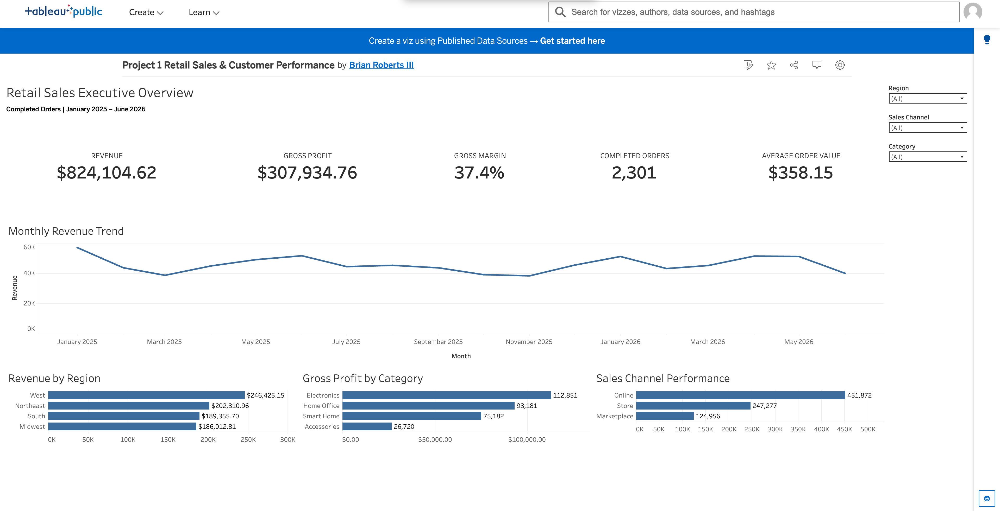

# Retail Sales Analytics

## Project Overview

This project is an end-to-end retail sales analysis designed to identify the key drivers of revenue, profitability, customer behavior, product performance, and returns.

The project demonstrates a complete data analytics workflow using:

- Google Sheets for data exploration and KPI analysis
- Google BigQuery for SQL analysis
- Tableau for data visualization
- GitHub for project documentation and SQL version control

The dataset is synthetic and was created for portfolio and analytics practice.

---

## Live Tableau Dashboard

View the interactive dashboard on Tableau Public:

[View Retail Sales Executive Overview]([PASTE-TABLEAU-PUBLIC-LINK-HERE](https://public.tableau.com/views/Project1RetailSalesCustomerPerformance/RetailSalesExecutiveOverview?:language=en-US&publish=yes&:sid=&:redirect=auth&:display_count=n&:origin=viz_share_link))



---

## Business Problem

A multichannel retailer wants to better understand its sales performance and answer several business questions:

1. Which regions generate the most revenue and profit?
2. Which product categories are the strongest performers?
3. Which sales channels contribute the most revenue?
4. How does performance change over time?
5. Which products or categories have elevated return rates?
6. Which customer segments generate the most value?

---

## Dataset

The project contains five relational tables:

| Table | Description |
|---|---|
| customers | Customer information, segment, region, and acquisition source |
| products | Product category, pricing, cost, and product tier |
| orders | Order date, customer, sales channel, status, and shipping information |
| order_items | Product-level quantity, revenue, cost, and gross profit |
| returns | Returned order items, return reasons, and resolutions |

Approximate dataset size:

- 600 customers
- 120 products
- 2,500 orders
- 6,154 order items
- 220 returns

---

## Tools Used

### Google Sheets
Used for:

- Initial data exploration
- KPI calculations
- Pivot-style analysis
- Revenue and profitability analysis
- Business findings and recommendations

### Google BigQuery / SQL
Used for:

- Filtering and sorting data
- Aggregations
- Joining relational tables
- KPI calculations
- Customer analysis
- Product performance analysis
- Return analysis
- Window functions and trend analysis

### Tableau
Will be used to create interactive dashboards for:

- Executive sales performance
- Customer and product analysis
- Returns and operational performance

---

## Key KPIs

Initial analysis identified:

- **Revenue:** $824,104.62
- **Gross Profit:** $307,934.76
- **Gross Margin:** 37.4%
- **Completed Orders:** 2,301
- **Average Order Value:** $358.15
- **Units per Order:** 3.27
- **Return Rate:** 3.6%
- **Repeat Customer Rate:** 91.8%

---

## Initial Business Findings

### 1. Regional Performance

The West generated the highest regional revenue at **$246,425.15**.

Its gross margin was **37.1%**, approximately 0.3 percentage points below the overall margin of 37.4%.

This suggests that the West is a major sales driver, while presenting an opportunity to investigate product mix, discounting, and costs.

### 2. Product Category Performance

Electronics generated the highest revenue and produced the highest gross profit at **$112,851.31**.

This was **$19,670.04 more gross profit than Home Office**, the second-highest category at $93,181.27.

Electronics is therefore an important contributor to overall business profitability.

### 3. Sales Channel Performance

The Online channel generated the highest revenue at **$451,871.66** while maintaining a **37.6% gross margin**.

This indicates that online sales contribute both significant sales volume and healthy profitability.

### 4. Monthly Performance

January 2025 was the strongest observed month with **$21,278.29 in revenue**, while March 2025 generated **$14,416.94**.

Further analysis is needed to determine whether seasonality, promotions, customer behavior, or product mix caused the variation.

---

## Business Recommendations

1. **Investigate West-region profitability**  
   Review product mix, discount levels, product costs, and returns to identify why margins are slightly below the company average.

2. **Prioritize profitable Electronics products**  
   Identify products with strong sales volume, margins, and low return rates before increasing inventory or promotional investment.

3. **Leverage the Online channel**  
   Analyze the products, customer segments, and promotions associated with strong online sales and use those findings to improve weaker periods.

---

## Dashboard Overview

The Tableau dashboard provides an executive-level view of retail performance across January 2025 through June 2026.

### Dashboard Features

- Revenue, gross profit, gross margin, completed orders, and average order value KPIs
- Monthly revenue trend analysis
- Revenue comparison by region
- Gross profit analysis by product category
- Sales channel performance
- Interactive Region, Category, and Sales Channel filters

### Key Dashboard Findings

- The West generated the highest regional revenue at **$246,425.15**
- Electronics generated the highest gross profit at **$112,851.31**
- Online was the strongest sales channel with **$451,871.66 in revenue**
- Overall gross margin was approximately **37.4%**
- The business generated **$824,104.62 in completed-order revenue**

---

## SQL Analysis

SQL queries are organized in the `/sql` directory.

Current files:

- `01_sql_fundamentals.sql` — SELECT, WHERE, filtering, and ORDER BY
- `02_kpi_analysis.sql` — coming next
- `03_sales_performance.sql` — planned
- `04_customer_analysis.sql` — planned
- `05_advanced_analysis.sql` — planned

---

## Project Status

- [x] Google Sheets data preparation
- [x] Initial KPI analysis
- [x] Business findings and recommendations
- [x] BigQuery SQL environment setup
- [x] SQL fundamentals
- [x] KPI analysis with SQL
- [x] Multi-table JOIN analysis
- [x] Customer analysis
- [x] Advanced SQL analysis
- [x] Tableau Executive Dashboard
- [x] Tableau Public publishing
- [x] GitHub project documentation

---

## Repository Structure

```text
retail-sales-analytics/
│
├── README.md
│
├── sql/
│   ├── 01_sql_fundamentals.sql
│   ├── 02_kpi_analysis.sql
│   ├── 03_sales_performance.sql
│   ├── 04_customer_analysis.sql
│   └── 05_advanced_analysis.sql
│
├── screenshots/
│   ├── google_sheets_dashboard.png
│   └── tableau_dashboard.png
│
└── data/
    └── README.md
